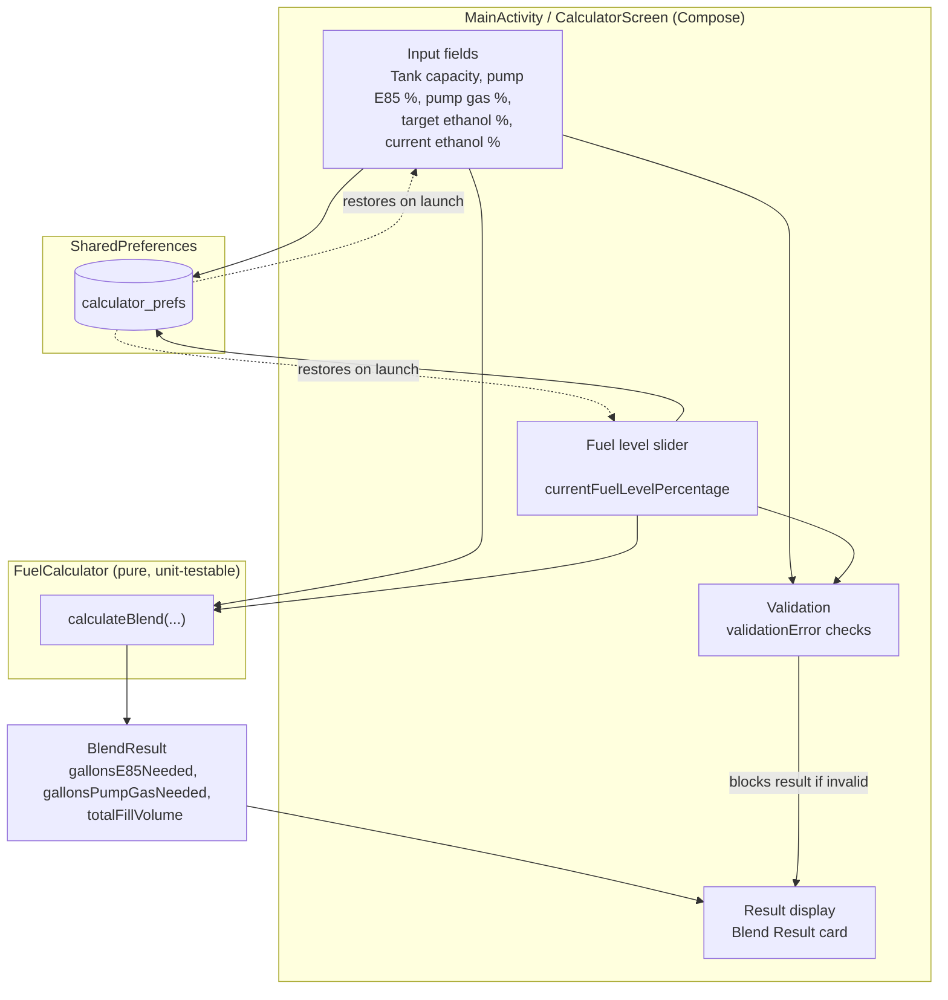

# E85 Calculator 🌽

A native Android app that tells drivers of flex-fuel vehicles exactly how many gallons of E85 and pump gas to add to hit a target ethanol blend, given whatever fuel is already in the tank.

<!-- SCREENSHOT: [App icon / home screen launcher tile on an Android device] -->

## Overview

Flex-fuel vehicles can run on any blend of gasoline and E85 (a high-ethanol fuel), and many owners "splash blend" at the pump — mixing E85 and regular gas in the tank to hit a specific ethanol percentage (commonly for performance tuning). Doing this math by hand at the pump is error-prone: it requires accounting for the ethanol percentage of the fuel already in the tank, the actual volume remaining, and the ethanol content of both fuels being added.

E85 Calculator solves this with a single-screen tool that:

- Takes the tank's total capacity, current fuel level, and the ethanol percentage already in the tank.
- Takes the ethanol percentage of the pump's E85 and regular gas.
- Solves for the exact gallons of each fuel needed to hit a target ethanol percentage after filling up.
- Validates inputs in real time and surfaces clear, specific error messages when a target isn't mathematically achievable (e.g., not enough tank space, target below the pump gas percentage, etc.).
- Persists all inputs locally so the next fill-up starts where the last one left off.

<!-- SCREENSHOT: [Full app screen showing the Fuel Setup card, fuel level slider, and Blend Result card with a calculated gallon split] -->

## Features

- **Blend math solved for you** — enter tank capacity, current ethanol %, target ethanol %, and the pump's E85/gas percentages; the app returns gallons of each to add.
- **Live fuel level slider** — drag to set how full the tank currently is; gallons-in-tank updates instantly.
- **Real-time validation** — catches impossible or contradictory inputs (target above/below achievable range, insufficient tank space, pump percentages reversed) before you act on bad numbers.
- **Resulting mixture preview** — shows the final ethanol percentage the tank will land on after the blend.
- **Persistent state** — all fields are saved to `SharedPreferences`, so values survive app restarts.
- **Screen-on-while-active** — keeps the display awake while the app is in the foreground, since it's designed to be used standing at a gas pump.
- **Portrait-locked, height-adaptive layout** — UI density scales to fit smaller screens without scrolling.

## Tech Stack

| Layer | Technology |
|---|---|
| Language | [Kotlin](https://kotlinlang.org/) |
| UI Toolkit | [Jetpack Compose](https://developer.android.com/jetpack/compose) + Material 3 |
| Architecture | Single-Activity, stateful Composable (`CalculatorScreen`) with a pure-function calculation core (`FuelCalculator`) |
| Persistence | Android `SharedPreferences` |
| Build System | Gradle (Kotlin DSL) with version catalogs (`libs.versions.toml`) |
| Testing | JUnit4, AndroidX Test / Espresso, Compose UI Test |
| Min SDK / Target SDK | 24 / 37 |

The core blend math lives in [`FuelCalculator.kt`](app/src/main/java/com/example/e85calculator/FuelCalculator.kt) as a stateless, unit-testable object, kept fully decoupled from the Compose UI in [`MainActivity.kt`](app/src/main/java/com/example/e85calculator/MainActivity.kt).



## Local Installation

### Prerequisites

- [Android Studio](https://developer.android.com/studio) (Ladybug or newer recommended)
- JDK 11+
- An Android device or emulator running API 24 (Android 7.0) or later

### Setup

1. Clone the repository:
   ```bash
   git clone <repository-url>
   cd E85Calculator
   ```
2. Open the project in Android Studio and let it sync Gradle, or build from the command line:
   ```bash
   ./gradlew assembleDebug
   ```
3. Run on a connected device or emulator:
   ```bash
   ./gradlew installDebug
   ```
   or use the **Run** button in Android Studio.

### Running Tests

```bash
./gradlew test              # unit tests
./gradlew connectedAndroidTest   # instrumented UI tests (requires a device/emulator)
```

## AI-Assisted Development

This project was built using an AI-assisted workflow with Claude Code as a pair-programming collaborator throughout the entire lifecycle, not just for boilerplate generation.

**Prototyping:** The initial core functionality — the ethanol-blend algebra in `FuelCalculator`, the Compose input form, and the SharedPreferences persistence layer — was scaffolded through conversational iteration, going from a plain-language description of the blending problem straight to working Kotlin.

**Iterative refinement:** The commit history reflects a tight feedback loop between manual testing and AI-assisted fixes, including:
- Correcting a calculation bug where the resulting ethanol percentage used the full tank capacity instead of the actual current fuel volume.
- Adding real-time input validation with human-readable, actionable error messages (e.g., flagging when a target percentage isn't reachable given the pump's fuel options).
- A full UI overhaul from a functional-but-plain layout to a card-based Material 3 design with animated result transitions.
- Screen-size-aware layout scaling and portrait-lock adjustments to keep the calculator usable one-handed at a gas pump.

**Division of labor:** AI tooling handled first-draft implementation, refactors, and bug triage from described symptoms; every change was manually reviewed, run on-device, and tested against real-world fill-up scenarios before being committed. Architectural decisions (keeping the blend math as a pure, UI-free function; what state needs to persist; validation rules) were driven by the project owner, with the AI assisting on implementation and Kotlin/Compose idiom.

## Project Structure

```
app/src/main/java/com/example/e85calculator/
├── MainActivity.kt        # Single Activity, Compose UI, state, persistence
├── FuelCalculator.kt      # Pure blend-calculation logic (unit-testable)
└── ui/theme/              # Material 3 theme, color scheme, typography
```