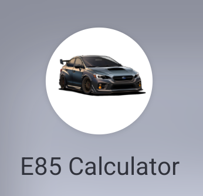
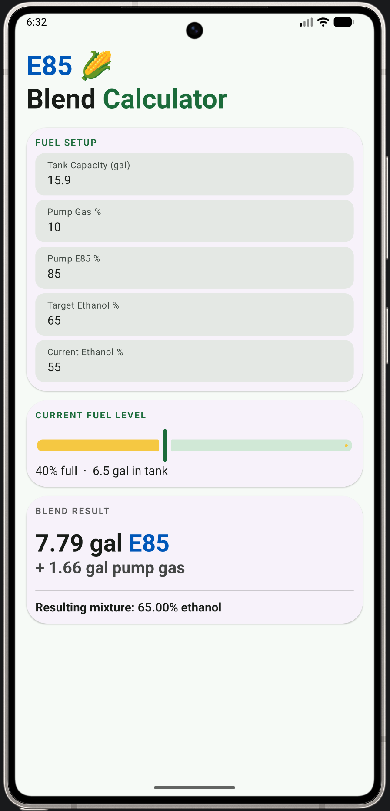
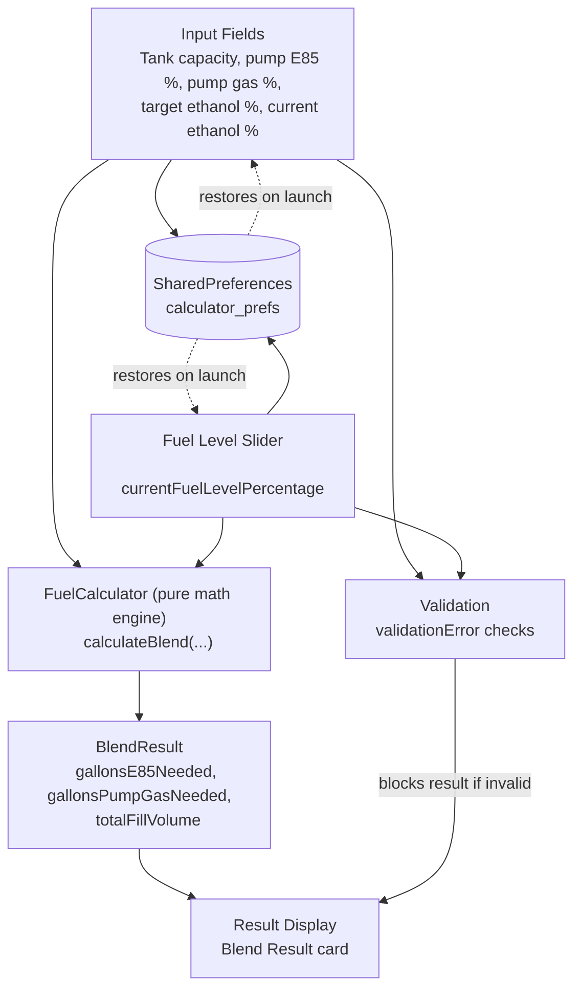

# E85 Calculator 🌽

A native Android app that tells drivers of flex-fuel vehicles exactly how many gallons of E85 and pump gas to add to hit a target ethanol blend, given whatever fuel is already in the tank.

<p align="center">
  
</p>

## Overview

Flex-fuel vehicles can run on any blend of gasoline and E85 (a high-ethanol fuel), and many owners "splash blend" at the pump - mixing E85 and regular gas in the tank to hit a specific ethanol percentage (commonly for performance tuning). Doing this math by hand at the pump is error-prone: it requires accounting for the ethanol percentage of the fuel already in the tank, the actual volume remaining, and the ethanol content of both fuels being added.

E85 Calculator solves this with a single-screen tool that:

- Takes the tank's total capacity, current fuel level, and the ethanol percentage already in the tank.
- Takes the ethanol percentage of the pump's E85 and regular gas.
- Solves for the exact gallons of each fuel needed to hit a target ethanol percentage after filling up.
- Validates inputs in real time and surfaces clear, specific error messages when a target isn't mathematically achievable (e.g., not enough tank space, target below the pump gas percentage, etc.).
- Persists all inputs locally so the next fill-up starts where the last one left off.

<p align="center">
  
</p>

## Features

- **Blend math solved for you** - enter tank capacity, current ethanol %, target ethanol %, and the pump's E85/gas percentages; the app returns gallons of each to add.
- **Live fuel level slider** - drag to set how full the tank currently is; gallons-in-tank updates instantly.
- **Real-time validation** - catches impossible or contradictory inputs (target above/below achievable range, insufficient tank space, pump percentages reversed) before you act on bad numbers.
- **Resulting mixture preview** - shows the final ethanol percentage the tank will land on after the blend.
- **Persistent state** - all fields are saved to `SharedPreferences`, so values survive app restarts.
- **Screen-on-while-active** - keeps the display awake while the app is in the foreground, since it's designed to be used standing at a gas pump.
- **Portrait-locked, height-adaptive layout** - UI density scales to fit smaller screens without scrolling.

## Getting Started

You can either install the pre-compiled application directly on your Android device or build the project from source using Android Studio.

### Option 1: Quick Install (APK)

The fastest way to test the calculator on an Android device:

1. Download the latest **`.apk`** file from the [Releases Page](https://github.com/alexisbailon1/e85-calculator/releases/latest).
2. Open the downloaded file on your Android device.
3. If prompted, allow your phone or browser to install apps from "Unknown Sources" (required for side-loading apps outside the Google Play Store).

---

### Option 2: Build from Source

#### Prerequisites

- [Android Studio](https://developer.android.com/studio) (Ladybug or newer recommended)
- JDK 11+
- An Android device or emulator running API 24 (Android 7.0) or later

#### Setup

1. Clone the repository and navigate into the project directory:
   ```bash
   git clone https://github.com/alexisbailon1/e85-calculator.git
   cd e85-calculator
   ```

2. Open the project in Android Studio and let it sync Gradle, or compile via command line:
   ```bash
   ./gradlew assembleDebug
   ```

3. Run on a connected device or emulator:
   ```bash
   ./gradlew installDebug
   ```
   or simply use the **Run** button in Android Studio.

## Tech Stack

| Layer | Technology |
|---|---|
| Language | [Kotlin](https://kotlinlang.org/) |
| UI Toolkit | [Jetpack Compose](https://developer.android.com/jetpack/compose) + Material 3 |
| Architecture | Single-Activity, stateful Composable (`CalculatorScreen`) with a pure-function calculation core (`FuelCalculator`) |
| Persistence | Android `SharedPreferences` |
| Build System | Gradle (Kotlin DSL) with version catalogs (`libs.versions.toml`) |
| Min SDK / Target SDK | 24 / 37 |

The core blend math lives in [`FuelCalculator.kt`](app/src/main/java/com/example/e85calculator/FuelCalculator.kt) as a stateless, pure calculation object, kept fully decoupled from the Compose UI in [`MainActivity.kt`](app/src/main/java/com/alexisbailon/e85calculator/MainActivity.kt).



## Architecture Migration & Development Methodology

This project represents a complete architectural migration from a cross-platform framework to a high-performance native stack, leveraging an AI-assisted engineering workflow to accelerate execution without sacrificing architectural control.

### From .NET MAUI to Native Android
E85 Calculator was originally built and deployed as a fully functional, private utility application developed in **.NET MAUI (C#)**. To achieve optimal runtime performance, superior UI responsiveness, and long-term maintainability for its public open-source release, the application was systematically re-architected into native Android using **Kotlin and Jetpack Compose**.

### AI as a Force Multiplier
Rather than utilizing AI for simple prompt-to-code generation, **Claude Code** was integrated into the development lifecycle as an interactive pair-programmer and code-translation engine:
- **Cross-Platform Translation:** Accelerated the syntax and paradigm migration of the core mathematical blending algebra from C# to standalone Kotlin within `FuelCalculator.kt`.
- **UI Modernization:** Assisted in translating declarative UI structures into modern Material 3 Jetpack Compose components, including custom interactive sliders and card-based layout transitions.
- **Iterative Refactoring:** Handled syntax adaptation and bug triage during the transition to Android-native persistence (`SharedPreferences`) and height-adaptive layout scaling.

### Engineering Ownership & Validation
While AI tooling accelerated code translation and boilerplate scaffolding, all core systems architecture and quality standards were driven entirely by the project owner:
- **Architectural Design:** Designed the single-activity Composable structure (`CalculatorScreen`) and enforced strict decoupling between the UI layer and the pure, stateless mathematical core.
- **Domain Logic & Safety:** Defined all real-time mathematical boundary checks and validation error states to prevent impossible blending calculations at the pump.
- **Real-World Verification:** Every translated component and refactored calculation was manually code-reviewed, executed on physical Android devices, and validated against real-world gas station fill-up scenarios before committing to version control.

## Project Structure

```
app/src/main/java/com/example/e85calculator/
├── MainActivity.kt        # Single Activity, Compose UI, state, persistence
├── FuelCalculator.kt      # Pure blend-calculation logic (unit-testable)
└── ui/theme/              # Material 3 theme, color scheme, typography
```