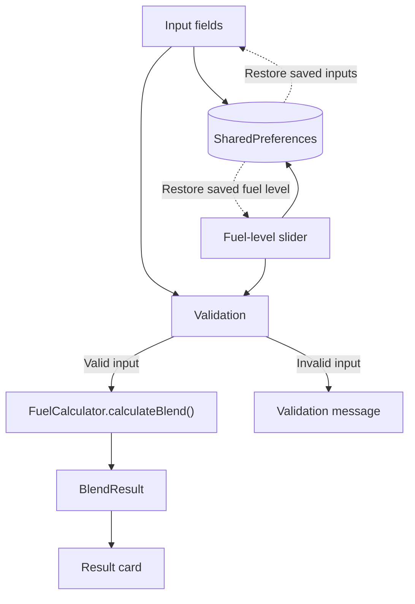

# E85 Calculator 🌽

A native Android application that calculates how many gallons of E85 and pump gasoline to add to reach a target ethanol blend based on the fuel already in the tank.

## Overview

Drivers of flex-fuel and performance-tuned vehicles may mix E85 with regular gasoline to reach a specific ethanol percentage. Calculating that mixture manually requires accounting for:

- Tank capacity
- Current fuel volume
- Current ethanol percentage
- Actual ethanol content of the available E85
- Ethanol content of the available pump gasoline
- Desired final ethanol percentage

E85 Calculator performs this calculation in real time and reports the amount of each fuel to add. It also detects targets that cannot be reached with the available tank space and fuel percentages.

## Features

- **Ethanol blend calculation** — calculates the gallons of E85 and pump gasoline needed to reach the selected target.
- **Live fuel-level control** — updates the estimated fuel currently in the tank as the slider moves.
- **Real-time validation** — identifies missing, contradictory, or mathematically impossible inputs before displaying a result.
- **Result preview** — displays the expected final ethanol percentage after filling.
- **Persistent inputs** — saves calculator values locally with `SharedPreferences`.
- **Screen-awake behavior** — keeps the display active while the application is in the foreground.
- **Adaptive layout** — adjusts interface density for devices with different screen heights.
- **Offline operation** — performs all calculations locally without an account or network connection.

## Screenshots

<p align="center">
  
  &nbsp;&nbsp;
  
</p>

## Calculation Model

The calculator treats ethanol content as a volume balance.

Let:

- `T` = total tank capacity
- `V` = current fuel volume
- `F = T - V` = available fill volume
- `c` = current ethanol fraction
- `e` = E85 ethanol fraction
- `g` = pump-gas ethanol fraction
- `t` = target ethanol fraction
- `x` = E85 volume to add
- `y` = pump-gas volume to add

The two required relationships are:

```text
x + y = F
cV + ex + gy = tT
```

Solving for the amount of E85 gives:

```text
x = (tT - cV - gF) / (e - g)
y = F - x
```

A blend is considered achievable only when the calculated values are finite and both `x` and `y` fall within the available fill volume.

The calculation is implemented in [`FuelCalculator.kt`](app/src/main/java/com/alexisbailon/e85calculator/FuelCalculator.kt) as stateless domain logic separate from the Compose interface.

## Architecture

The application uses a small, single-activity architecture suited to its focused scope:

- `MainActivity` hosts the Compose interface.
- `CalculatorScreen` owns the current UI state and input-validation flow.
- `FuelCalculator` performs the blend calculation without Android UI dependencies.
- `SharedPreferences` stores user inputs between launches.

This is intentionally a stateful Compose implementation rather than an MVVM architecture. The calculation logic remains isolated so it can be tested and changed independently from the interface.



## Tech Stack

| Area | Technology |
|---|---|
| Language | [Kotlin](https://kotlinlang.org/) |
| User interface | [Jetpack Compose](https://developer.android.com/jetpack/compose) and Material 3 |
| Application structure | Single Activity with a stateful Compose screen |
| Domain logic | Stateless Kotlin calculation object |
| Persistence | Android `SharedPreferences` |
| Build system | Gradle Kotlin DSL with a version catalog |
| Minimum Android API | 24 |

## Getting Started

### Install the APK

1. Open the [latest GitHub release](https://github.com/alexisbailon1/e85-calculator/releases/latest).
2. Download the attached `.apk` file.
3. Open the file on an Android device and follow the installation prompt.

Android may ask for permission to install an application obtained outside the Play Store. Only install release files downloaded from this repository.

### Build from Source

#### Prerequisites

- [Android Studio](https://developer.android.com/studio)
- The JDK bundled with the supported Android Studio version
- An Android device or emulator running API 24 or later

#### Setup

1. Clone the repository:

   ```bash
   git clone https://github.com/alexisbailon1/e85-calculator.git
   cd e85-calculator
   ```

2. Open the project in Android Studio and allow Gradle to synchronize.

3. Build a debug APK:

   ```bash
   ./gradlew assembleDebug
   ```

4. Install the debug build on a connected device or running emulator:

   ```bash
   ./gradlew installDebug
   ```

The application can also be launched with the **Run** button in Android Studio.

## Project Structure

```text
app/src/main/java/com/alexisbailon/e85calculator/
├── MainActivity.kt        # Compose UI, state, validation, and persistence
├── FuelCalculator.kt      # Stateless blend-calculation logic
└── ui/theme/              # Material 3 colors, typography, and theme
```

## Migration History

The public Android version was reimplemented from an earlier private application built with .NET MAUI and C#. The migration moved the interface to Jetpack Compose and the calculation logic to standalone Kotlin.

AI-assisted development tools were used during portions of translation, debugging, and refactoring. The resulting code, calculation behavior, validation rules, and device behavior were reviewed and tested manually before release.

## Validation

The application checks for conditions including:

- Missing or nonnumeric values
- Percentages outside the supported range
- Pump-gas ethanol content greater than or equal to the E85 ethanol content
- A target below or above the achievable range
- Insufficient remaining tank capacity
- Calculated fuel amounts outside the fillable volume

> **Important:** Fuel ethanol content can vary by location, season, and supplier. The result is only as accurate as the values entered. Verify pump labels or measured ethanol content before relying on the calculation.

## Contributing

Issues and pull requests are welcome. For a proposed change:

1. Create a branch from `main`.
2. Keep calculation logic separate from Compose UI code when practical.
3. Describe the behavior being changed.
4. Include tests for changes to blend calculations or validation rules when possible.
5. Open a pull request with screenshots for visible interface changes.
